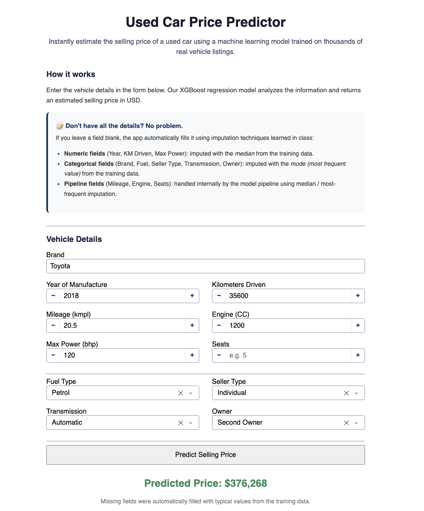

# Used Car Price Predictor

A web-based **used car price prediction application** built with **Dash** and **Plotly**. 
Users enter vehicle details through a browser-based form, and can choose between two 
models — an **XGBoost regression model** (from A1) and a **from-scratch Polynomial 
Regression model** (built for A2) — to get an estimated selling price.

The application supports **partial inputs**. When users leave fields blank, missing 
values are automatically imputed using statistics derived from the training data or 
handled internally by the model pipeline.

Docker Hub A1: https://hub.docker.com/repository/docker/imtiaz3445/car_price_predictor-app/general <br>
Docker Hub A2: https://hub.docker.com/repository/docker/imtiaz3445/car-price-app-v2/general

**Live deployment:** `https://web-st126685.ml.brain.cs.ait.ac.th`

---

## 🆕 What's New in A2

The application now offers two prediction models, selectable from the navigation bar:

| Page | Model | Description |
|---|---|---|
| **Classic Model** | XGBoost (A1) | Original gradient-boosted tree model |
| **New Model** | Polynomial Regression (A2) | From-scratch linear regression with polynomial feature expansion, trained via stochastic gradient descent |
| **Compare** | Both | Runs both models side-by-side on the same input and shows the difference in estimated price |

The new model was selected via a full grid search across regression type, gradient 
descent method, weight initialization, momentum, and learning rate — tracked end-to-end 
with MLflow. Full experiment details, findings, and evaluation are documented in 
(.A2/st126685_A2 - Predicting Car Prices (1).ipynb).

---

## 📁 Application Structure

```text
car_price_predictor/
├── .Dockerfile
├── docker-compose.yaml
├── requirements.txt
└── code/
    ├── app.py
── saved_models/
        ├── xgb_best_model.pkl       # A1
        ├── ct.pkl                   # A2
        ├── sk.pkl                   # A2
        ├── poly.pkl                 # A2
        ├── weights4.json            # A2
        └── imputation_defaults.json # A1
├── A1
├── A2
```

> **Note:** Ensure that the `saved_models/` directory and its model files are available 
> at the expected location before running the application.

---

## 🚀 Quick Start

### Option 1: Run Locally Without Docker

#### Prerequisites

- Python 3.10+
- pip

#### Setup

Navigate to the application directory:

```bash
cd app
```

Install the required dependencies:

```bash
pip install -r requirements.txt
```

Start the application:

```bash
python code/app.py
```

#### Access the Application

Open your browser and navigate to:

```text
http://127.0.0.1:8050
```

---

### Option 2: Run with Docker

Docker is the recommended way to run the application because it provides a consistent 
environment.

#### Prerequisites

- Docker
- Docker Compose

#### Build and Start

Navigate to the application directory:

```bash
cd car_price_predictor
```

Build the Docker image and start the container:

```bash
docker-compose up --build
```

To run the application in detached mode:

```bash
docker-compose up --build -d
```

#### Access the Application

Open your browser and navigate to:

```text
http://localhost:8050
```

---

## 📝 How to Use

1. Open the application in your web browser.
2. Choose **Classic Model**, **New Model**, or **Compare** from the navigation bar.
3. Enter the vehicle details in the prediction form.
4. Provide as much information as you have available — leave any unknown fields blank.
5. Click **"Predict Selling Price"**.
6. The application will display the estimated selling price within seconds. In 
   **Compare** mode, both models' predictions are shown side by side along with the 
   percentage difference between them.

### Supported Input Features

Both models expect the following **11 features**:

| Feature | Description |
|---|---|
| `brand` | Vehicle brand |
| `year` | Manufacturing year |
| `km_driven` | Distance driven in kilometers |
| `mileage` | Vehicle mileage |
| `engine` | Engine capacity |
| `max_power` | Maximum engine power |
| `seats` | Number of seats |
| `fuel` | Fuel type |
| `seller_type` | Type of seller |
| `transmission` | Transmission type |
| `owner` | Previous ownership information |



---

## 🔄 Missing Value Handling

The application supports partial user input. Missing values are handled using the 
following strategies:

### Median Imputation

Numeric fields are filled using their **median values** calculated from the training 
data:

- `year`
- `km_driven`
- `max_power`

### Mode Imputation

Categorical fields are filled using their **most frequently occurring values (mode)**:

- `brand`
- `fuel`
- `seller_type`
- `transmission`
- `owner`

### Pipeline-Based Imputation

The following fields are handled internally by the model pipeline:

- `mileage`
- `engine`
- `seats`

This allows users to obtain predictions even when some vehicle information is 
unavailable, regardless of which model is selected.

---

## 🤖 Machine Learning Models

### Classic Model — XGBoost (A1)

Stored as:
```text
./saved_models/xgb_best_model.pkl
```

### New Model — Polynomial Regression (A2)

A linear regression model implemented from scratch (custom gradient descent, no 
scikit-learn `LinearRegression`), trained on polynomial-expanded features. Selected via 
5-fold cross-validated grid search over regression type, gradient descent method, 
initialization, momentum, and learning rate.

- **Best configuration:** Polynomial features, Stochastic Gradient Descent, Xavier 
  initialization, no momentum, learning rate = 0.0001
- **Test set performance:** R² = 0.9042 (original price scale), R² = 0.8838 (log scale)

Stored as:
```text
./saved_models/weights4.json
./saved_models/ck.pkl # columntransformation
./saved_models/sk.pkl # feature selection
./saved_models/poly.pkl # transformation for polynomialfeatures
```

Full experimentation, MLflow tracking, and analysis are documented in 
(.A2/st126685_A2 - Predicting Car Prices (1).ipynb)..

---

## 🐳 Docker Notes

The Docker configuration is set up with the following considerations:

- The Dash application binds to `0.0.0.0:8050` inside the container.
- Container port `8050` is mapped to port `8050` on the host machine.
- The `saved_models/` directory (including both model files) is included in the Docker 
  build.
- All required model files must exist before building the image.
- In production, the container is not exposed directly — it is routed through 
  **Traefik** (reverse proxy) via a unique subdomain, with SSL/TLS handled by Traefik.

Required model files:

```text
saved_models/
├── xgb_best_model.pkl
├── imputation_defaults.json
├── weights4.json
├── ck.pkl # columntransformation
├── poly.pkl # transformation for polynomialfeatures
└── sk.pkl # feature selection
```

#### Stop the Container

```bash
docker-compose down
```

---

## ☁️ Deployment

The application is deployed on the `ml-brain` server (Ubuntu 24.04) behind a **Traefik** 
reverse proxy, accessible at:

**`https://web-st126685.ml.brain.cs.ait.ac.th`**

### Deployment Evidence

**1. Live application**

The homepage, showing both the Classic Model (XGBoost) and New Model (Polynomial 
Regression) options, accessed via the live subdomain (URL bar visible):


**2. Model comparison**

Example prediction using the Compare view, showing both models' estimates for the same 
input:


---

## 📦 Requirements

The project uses the following key Python dependencies:

```text
dash>=2.14
pandas>=1.5
numpy>=1.24
scikit-learn>=1.3
xgboost>=1.7
joblib>=1.3
```

For the complete list of dependencies and pinned versions, refer to:

```text
requirements.txt
```

---

## 🛠️ Technology Stack

- **Python** — Application and machine learning runtime
- **Dash** — Web application framework
- **Plotly** — Data visualization and UI components
- **Pandas** — Data manipulation
- **NumPy** — Numerical computation
- **Scikit-learn** — Preprocessing pipelines (ColumnTransformer, SelectKBest, etc.)
- **XGBoost** — Classic regression model (A1)
- **Custom Gradient Descent** — Polynomial regression model, implemented from scratch (A2)
- **MLflow** — Experiment tracking for the A2 grid search
- **Joblib** — Model/pipeline serialization
- **Docker** — Containerization
- **Docker Compose** — Container orchestration
- **Traefik** — Reverse proxy, subdomain routing, and SSL/TLS termination
