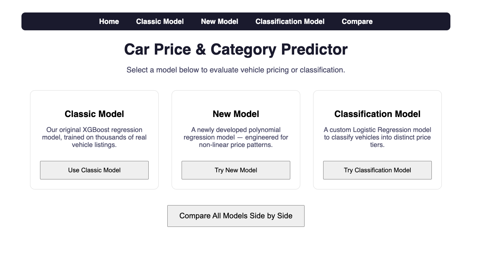
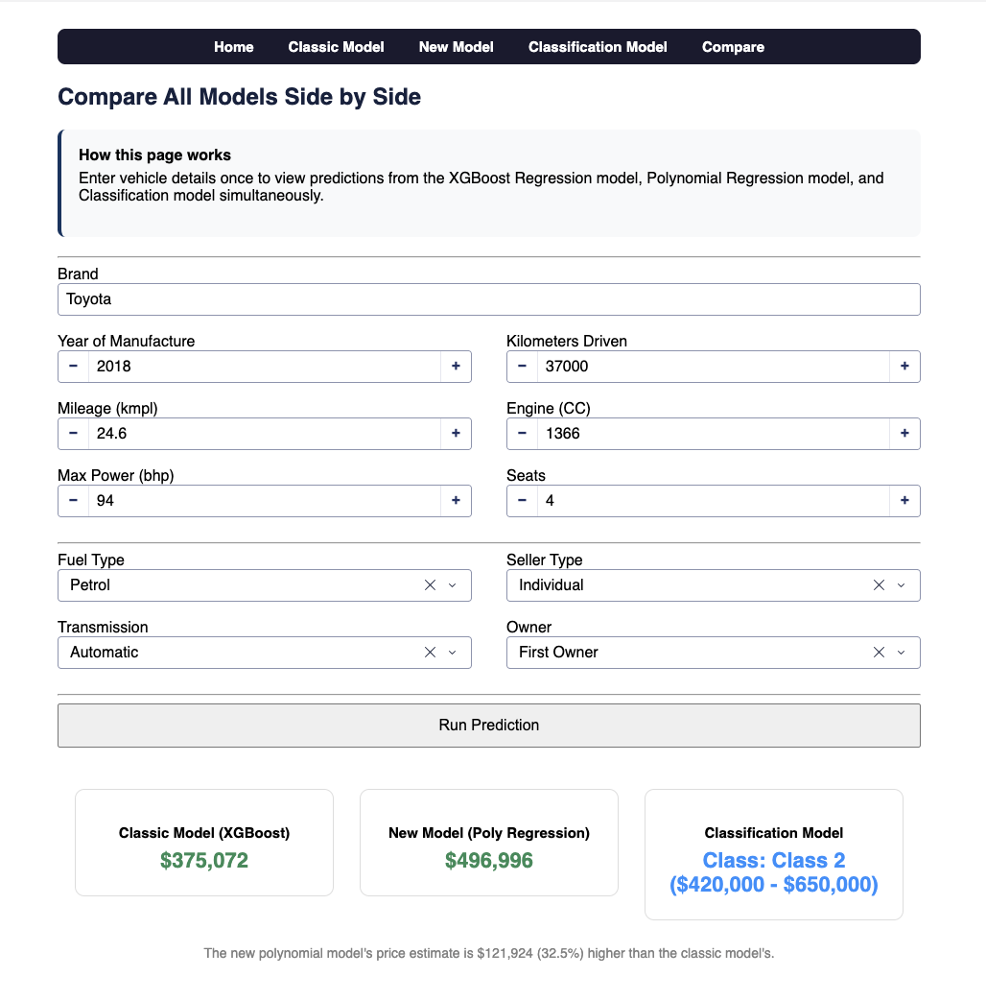

# Used Car Price & Category Predictor

A web-based **used car price prediction and price tier classification application** built with **Dash** and **Plotly**. Users enter vehicle details through an interactive web form to estimate car prices or predict price categories across three distinct machine learning models.

The application supports **partial inputs**. Missing vehicle fields are automatically imputed using dataset statistics or handled gracefully inside model preprocessing pipelines.

* **Live Deployment:** `https://web-st126685.ml.brain.cs.ait.ac.th`
* **Docker Hub A1:** `https://hub.docker.com/repository/docker/imtiaz3445/car_price_predictor-app/general`
* **Docker Hub A2:** `https://hub.docker.com/repository/docker/imtiaz3445/car-price-app-v2/general`
* **Docker Hub A3:** `https://hub.docker.com/repository/docker/imtiaz3445/car-price-app-v2/general`

---

## 📸 Application Interface

### Landing Page & Model Selection


### Side-by-Side Model Comparison


---

## 🆕 Overview of Assignments & Available Models

The application features three models accessible via the top navigation bar or side-by-side in the **Compare** view:

| Navigation Page | Model | Assignment | Description | Target / Output |
|---|---|---|---|---|
| **Classic Model** | XGBoost Regression | **A1** | Gradient-boosted decision tree regression model | Continuous Selling Price ($) |
| **New Model** | Polynomial Regression | **A2** | Custom linear regression with polynomial expansion trained via SGD from scratch | Continuous Selling Price ($) |
| **Classification Model** | Softmax Logistic Regression | **A3** | Custom multi-class Softmax Logistic Regression trained from scratch | Categorical Price Tier (Class 0–3) |
| **Compare** | All Models Side-by-Side | **A1 + A2 + A3** | Evaluates input vehicle across all three models simultaneously | Side-by-side estimates & price range |

---

## 📁 Application Structure

```text
car_price_predictor/
├── .github/
│   └── workflows/
│       └── ci-cd.yml                   # CI/CD Pipeline Configuration
├── .Dockerfile                         # Docker Container Definition
├── docker-compose.yaml                 # Docker Compose Services
├── requirements.txt                    # Dependency Definitions
├── classification_tiers.json           # A3 Price Tier Range Mappings
├── code/
│   └── app.py                          # Dash Application Source Code
│   └── Matrices.py                     # Logistic regression Code
│   └── Model.py                        # Matrices Code for Logistic regression
│   └── tests/                          # ci/cd test Code
├── saved_models/
│   ├── classification/                  # Contains all pre-processing Pipeline(pkl) for Logistic regression
│       ├──CL model/                    # Contains Logistic regression saved model info
│   ├── xgb_best_model.pkl              # A1 XGBoost Model
│   ├── imputation_defaults.json        # A1 Imputation Statistics
│   ├── weights4.json                   # A2 Polynomial Model Weights
│   ├── ct.pkl                          # Preprocessing ColumnTransformer
│   ├── poly.pkl                        # A2 Polynomial Feature Pipeline
│   ├── sk.pkl                          # A2 Feature Selection Pipeline
├── A1/                                 # Assignment 1 Files
├── A2/                                 # Assignment 2 Files
└── A3/                                 # Assignment 3 Files
```

---

## 🤖 Machine Learning Models

### 1. Classic Model — XGBoost (A1)
* **Model Type:** Gradient Boosted Decision Trees (XGBoost)
* **File:** `saved_models/xgb_best_model.pkl`

### 2. New Model — Polynomial Regression (A2)
* **Model Type:** Custom Linear Regression built from scratch with polynomial feature expansion, trained via SGD.
* **Selection:** Selected via 5-fold cross-validated grid search tracked using MLflow.
* **Performance:** Test set $R^2 = 0.9042$ (raw price scale).
* **Files:** `saved_models/weights4.json`, `poly.pkl`, `sk.pkl`, `ct.pkl`

### 3. Classification Model — Custom Softmax Logistic Regression (A3)
* **Model Type:** Custom Multi-Class Softmax Logistic Regression implemented from scratch supporting Batch, Mini-batch, and Stochastic Gradient Descent (SGD) with optional Ridge regularization.
* **Target Binning:** Selling prices are binned into 4 quantile price tiers (`Class 0` through `Class 3`) stored in `classification_tiers.json`.
* **Preprocessing Pipeline:** Feature cleaning (fuel filtering, numerical feature extraction), `SelectKBest` mutual information feature selection ($k=11$), degree-2 `PolynomialFeatures` expansion, and `StandardScaler` scaling.
* **Hyperparameter Optimization:** Evaluated across 100 experimental runs tracked with MLflow (`sqlite:///mlflow.db`).

---

## 🔄 Missing Value Handling

The application supports partial inputs through predefined imputation strategies:

* **Median Imputation:** Numeric fields (`year`, `km_driven`, `max_power`) are imputed using median values derived from the dataset.
* **Mode Imputation:** Categorical fields (`brand`, `fuel`, `seller_type`, `transmission`, `owner`) are populated using the most frequent categorical values.
* **Pipeline-Based Imputation:** Handled inside model transformers for `mileage`, `engine`, and `seats`.

---

## ⚡ CI/CD & Automated Deployment

This project incorporates Continuous Integration and Continuous Deployment (CI/CD) pipelines (via GitHub Actions / GitLab CI):

1. **Continuous Integration (CI):**
   * Automatically validates code formatting, linting, and syntax on every push or pull request.
   * Runs automated unit tests on data transformation pipelines and model inference functions.
2. **Continuous Deployment (CD):**
   * Automatically builds multi-stage Docker container images upon merging into the main branch.
   * Pushes updated container images directly to Docker Hub repository.
   * Triggers seamless deployment updates on the target server environment behind Traefik reverse proxy.

[](https://github.com/Imtiaz4201/car_price_predictor/actions/workflows/test-runner.yml)

---

## 📝 Supported Input Features

The models accept the following 11 vehicle attributes:

| Feature | Description |
|---|---|
| `brand` | Vehicle manufacturer / brand |
| `year` | Manufacturing year |
| `km_driven` | Total distance driven in kilometers |
| `mileage` | Fuel efficiency / mileage |
| `engine` | Engine displacement volume (CC) |
| `max_power` | Maximum output power (bhp) |
| `seats` | Total seating capacity |
| `fuel` | Fuel type (Diesel / Petrol) |
| `seller_type` | Vendor type (Individual / Dealer / Trustmark Dealer) |
| `transmission` | Transmission mode (Manual / Automatic) |
| `owner` | Previous ownership status |

---

## 🚀 Quick Start

### Option 1: Run Locally Without Docker

```bash
# Navigate to application directory
cd car_price_predictor

# Install required dependencies
pip install -r requirements.txt

# Launch Dash application
python code/app.py
```
Access the application at `http://127.0.0.1:8050`.

---

### Option 2: Run with Docker Compose

```bash
# Build and run containers in detached mode
docker-compose up --build -d
```
Access the application at `http://localhost:8050`.

---

## 🛠️ Technology Stack

* **Python 3.10+** — Language & Runtime Environment
* **Dash & Plotly** — Interactive Web Application & Data Visualization
* **Pandas & NumPy** — Data Preprocessing & Array Computations
* **Scikit-learn** — Pipeline Preprocessing (`SelectKBest`, `PolynomialFeatures`, `StandardScaler`)
* **XGBoost** — Classic Regression Model (A1)
* **Custom Gradient Descent** — Polynomial Regression (A2) and Softmax Logistic Regression (A3) implemented from scratch
* **MLflow** — Experiment Tracking & Model Registry
* **Docker & Docker Compose** — Application Containerization & Orchestration
* **Traefik** — Reverse Proxy, Subdomain Routing & SSL/TLS Termination
* **CI/CD Pipelines** — Automated Testing, Docker Image Builds & Deployment